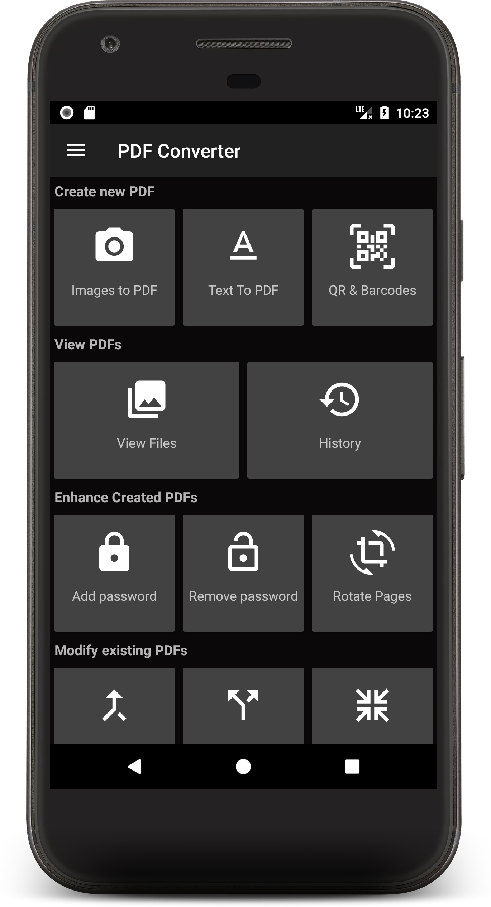
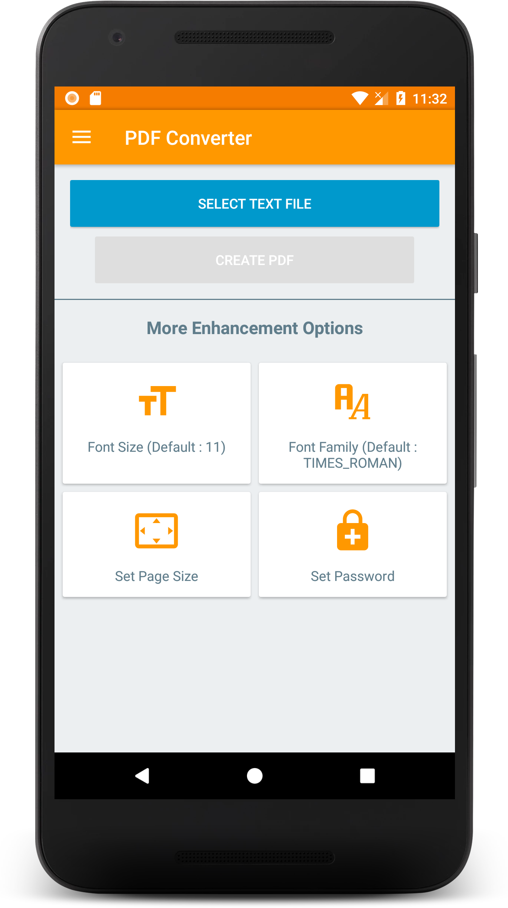
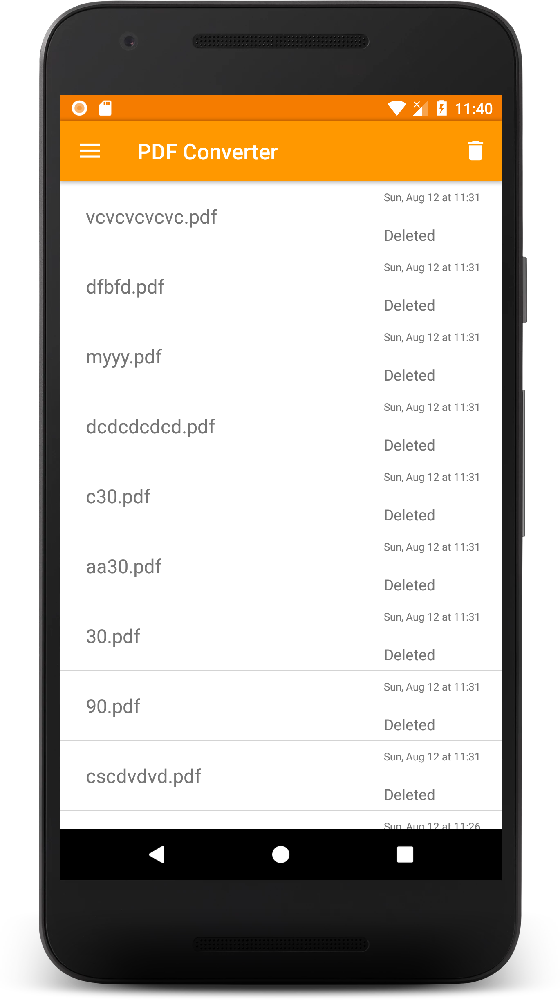

# Imagens para PDF

### Emblemas
[! [Status da compilação] (https://travis-ci.org/Swati4star/Images-to-PDF.svg?branch=master)] (https://travis-ci.org/Swati4star/Images-to-PDF)
[! [Código Clima] (https://codeclimate.com/github/Swati4star/Images-to-PDF.svg)] (https://codeclimate.com/github/Swati4star/Images-to-PDF) 
[! [Arsenal Android] (https://img.shields.io/badge/Android%20Arsenal-PDF%20Converter-blue.svg?style=true)] (https://android-arsenal.com/details/3/7132)

[] (https://f-droid.org/app/swati4star.createpdf)

Tem JPG quando você precisa de um PDF? Converta JPG para PDF em poucos segundos! :smiley:  
Aqui está um aplicativo Android fácil de usar para converter imagens para arquivo PDF!

### Apoie-nos

### Características 
- Criar PDF a partir de várias imagens da câmera ou galeria, texto ou arquivo de Excel
- Exibir seus PDFs convertidos
  - Abrir, Renomear, Excluir, imprimir, compartilhar arquivos
  - Ordenar a ordem dos arquivos com base em várias opções
  - Exibir detalhes do arquivo
  - Criptografar PDF
  - Descriptografar PDF
  - Girar páginas
- Temas diferentes
- Mesclar PDFs existentes
- Dividir PDFs existentes
- Converter arquivo de texto em PDFs
- Compactar PDF existente
- Remover páginas de um PDF
- Reorganizar páginas de um PDF
- Extrair imagens do PDF
- Histórico: Veja todas as conversões relacionadas ao PDF

Aqui está uma página inicial para obter acesso rápido a todos os recursos que o "PDF Converter" oferece:

 

### Criando um arquivo PDF

##### Passo 1 : O usuário pode visualizar os arquivos PDF criados anteriormente ou criar um novo! 

##### Passo 2 : Selecione as imagens
 

##### Passo 3 : Nomeie o arquivo PDF

##### Passo 4 : Criando PDF

OBAA! Arquivos PDF de imagens selecionadas são criados.

### Visualizando os arquivos PDF

 

### Temas diferentes
Vá para Configurações e você pode ter três tipos de temas: Preto, Escuro e Branco

Preto | Escuro | Branco |
--- | --- | --- |
 |  |   |

### Mesclar PDF

### Texto para PDF

### Código de Barras para PDF

### Arquivo Excel para PDF

### História

### Contribuindo

#### Dependências
+ [Butterknife] (https://jakewharton.github.io/butterknife/)
+ [Seletor de pastas] (https://github.com/kashifo/android-folder-picker-library)
+ [Recortador de imagem] (https://github.com/ArthurHub/Android-Image-Cropper)
+ [iTextG] (http://developers.itextpdf.com/itextg-android)
+ [Lottie] (https://github.com/airbnb/lottie-android)
+ [Matisse] (https://github.com/zhihu/Matisse)
+ [Diálogos de material] (https://github.com/afollestad/material-dialogs)
+ [Ondulação do material] (https://github.com/balysv/material-ripple)
+ [Botão de Morfização] (https://github.com/dmytrodanylyk/android-morphing-button)
+ [Picasso] (http://square.github.io/picasso/)
+ [Picasso-transformações] (https://github.com/wasabeef/picasso-transformations)
+ [Editor de Fotos] (https://github.com/burhanrashid52/PhotoEditor)
+ [viewpager-transformadores] (https://github.com/geftimov/android-viewpager-transformers)
+ [zxing] (https://github.com/zxing/zxing)

#### Código e Problemas
Se você é um desenvolvedor e deseja contribuir para o aplicativo, por favor, bifurque o projeto
e envie uma solicitação pull.
Siga o [Github Flow](https://help.github.com/articles/github-flow/) para colaboração!
Se você tiver alguma dúvida, sinta-se à vontade para perguntar [a mim] (mailto:swati4star@gmail.com) sobre o que quiser.
[Aqui] (https://github.com/Swati4star/Images-to-PDF/issues) é a lista de problemas conhecidos.

### Detentores  do Projeto
Este projeto é fundado e mantido ativamente por [Swati Garg](https://github.com/Swati4star/). Para qualquer tipo de dúvidas, sinta-se à vontade para enviar swati4star@gmail.com.