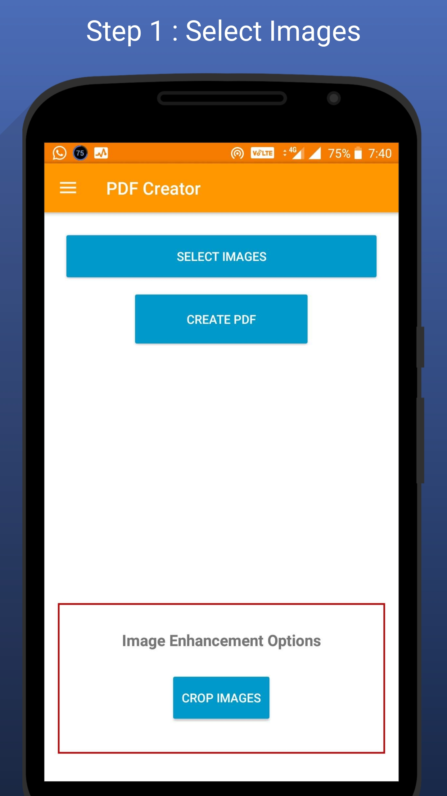
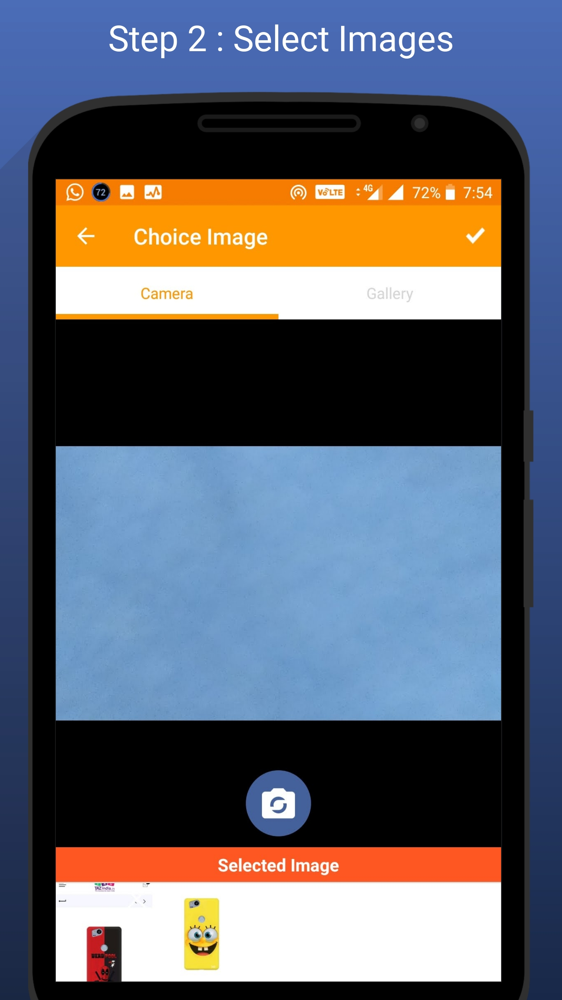
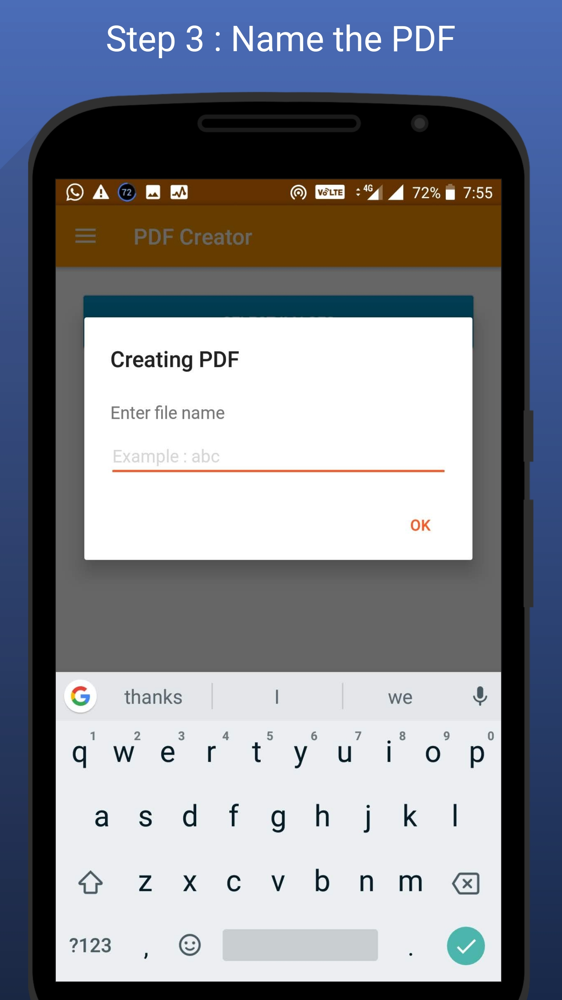
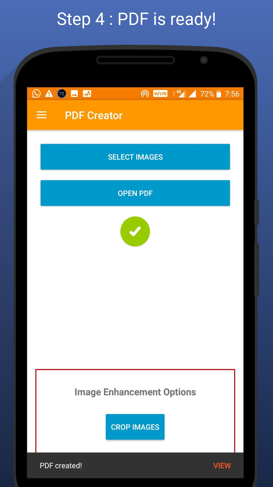
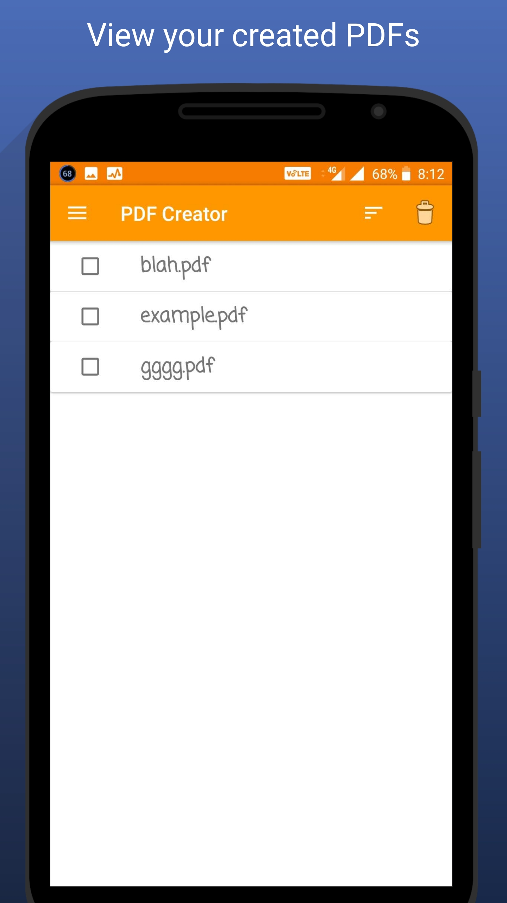
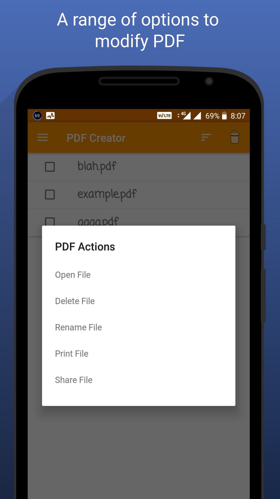

# Images To PDF

### Badges
 

Have JPG when you need a PDF? Convert JPG to PDF in a few seconds! :smiley:  
Here is an easy to use Android app to convert images to PDF file!

### Slack
You can also join the Images To PDF Team on Slack [https://imagestopdf.slack.com/](https://imagestopdf.slack.com/) and chat with developers. Use [this link](https://join.slack.com/t/imagestopdf/shared_invite/enQtMzY3NzkyODY2ODM5LTU2YTk3ZWExMmE0OTJjZGU3ODM1MGM4NzQ2OGNmNjhjYzYzYTBmMzdkNTkxZGY0NGYwZDI3MWQ1NDY5NzA3Yzk) to join our slack team.

#### Creating a PDF file

##### Step 1 : User can view the PDF files previously created or create a new one! 

##### Step 2 : Select the images
 

##### Step 3 : Name the PDF file

##### Step 4 : Creating PDF

Hurray! PDF files of selected images are created.

#### Viewing the PDF files

 

### Contributing

#### Dependencies
+ [iTextG](http://developers.itextpdf.com/itextg-android)
+ [Material Ripple](https://github.com/balysv/material-ripple)
+ [Morphing Button](https://github.com/dmytrodanylyk/android-morphing-button)
+ [TedPicker](https://github.com/ParkSangGwon/TedPicker)
+ [Material Dialogs](https://github.com/afollestad/material-dialogs)
+ [Compressor](https://github.com/zetbaitsu/Compressor)

#### Code & Issues
If you are a developer and you wish to contribute to the app please fork the project
and submit a pull request.
If you have any questions, feel free to ask [me](mailto:swati4star@gmail.com) about whatever you want.
[Here](https://github.com/Swati4star/Images-to-PDF/issues) is the list of known issues.

### Project Maintainers
This project is founded and actively maintained by [Swati Garg](https://github.com/Swati4star/). For any sort of queries feel free to mail at swati4star@gmail.com.
