# Images To PDF

### Badges

 

Have JPG when you need a PDF? Convert JPG to PDF in a few seconds! :smiley:  
Here is an easy to use Android app to convert images to PDF file!

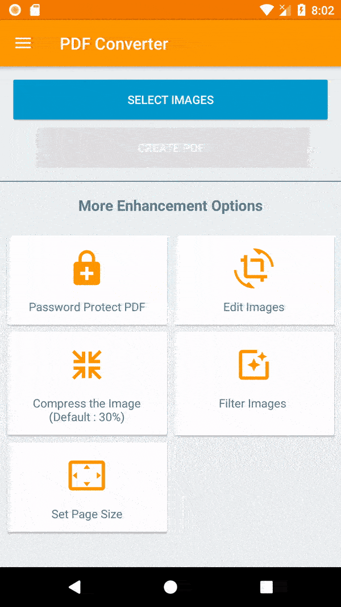

### Slack
You can also join the Images To PDF Team on Slack [https://imagestopdf.slack.com/](https://imagestopdf.slack.com/) and chat with developers. Use [this link](https://join.slack.com/t/imagestopdf/shared_invite/enQtNDA2ODk1NDE3Mzk3LTUwNjllYzY5YWZkZDliY2FmNDhkNmM1NjIwZTc1YjU4NTgxNWI0ZDczMWQxMTEyZjA0M2Y5N2RlN2NiMWRjZGI) to join our slack team.

### Features 
- Create PDF from multiple images from camera or gallery
- View your converted PDFs
  - Open, Rename, Delete, print, share files
  - Sort the files order based on a number of options
  - View File details (Path, size, date created ...)
  - Encrypt PDF
  - Decrypt PDF
  - Rotate Pages
- Different themes
- Merge existing PDFs
- Split existing PDFs
- Convert text file to PDFs
- Compress existing PDF
- Remove pages from a PDF
- Rearrange pages of a PDF
- Extract images from PDF
- History : View all the PDF related conversions

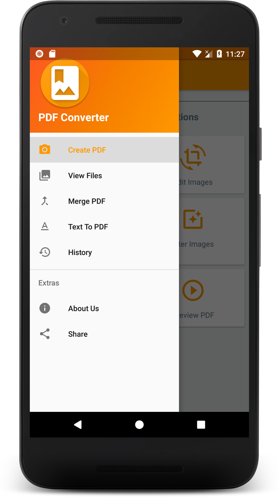

### Creating a PDF file

##### Step 1 : User can view the PDF files previously created or create a new one! 
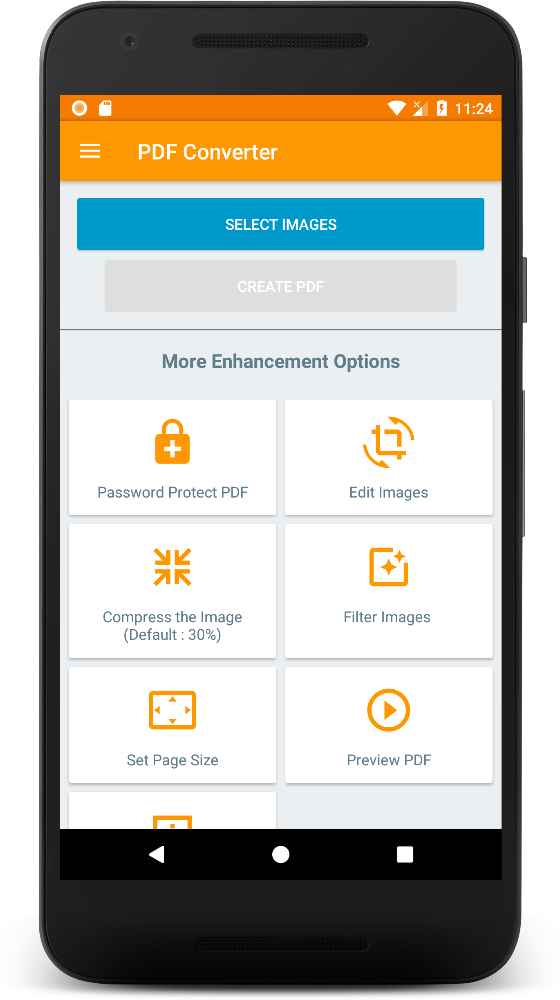

##### Step 2 : Select the images
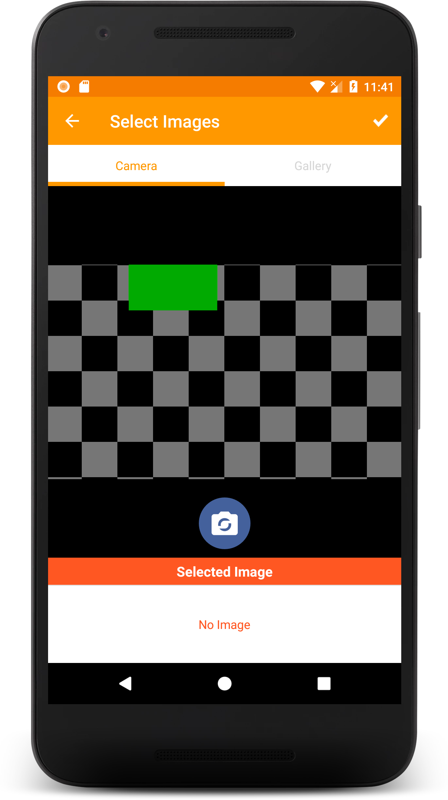 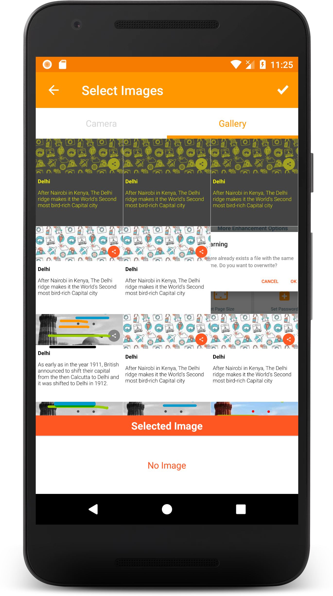

##### Step 3 : Name the PDF file
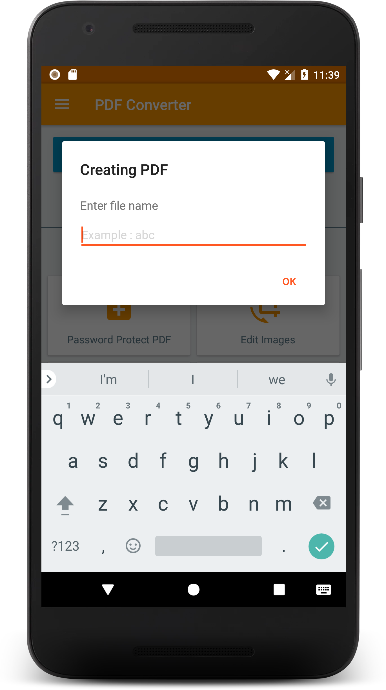

##### Step 4 : Creating PDF
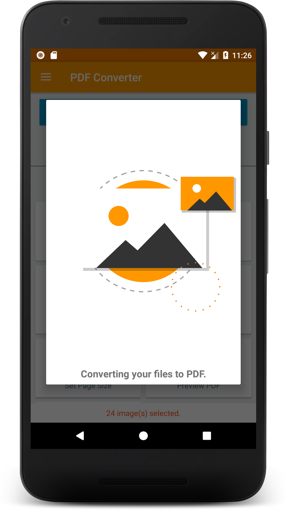

Hurray! PDF files of selected images are created.

### Viewing the PDF files

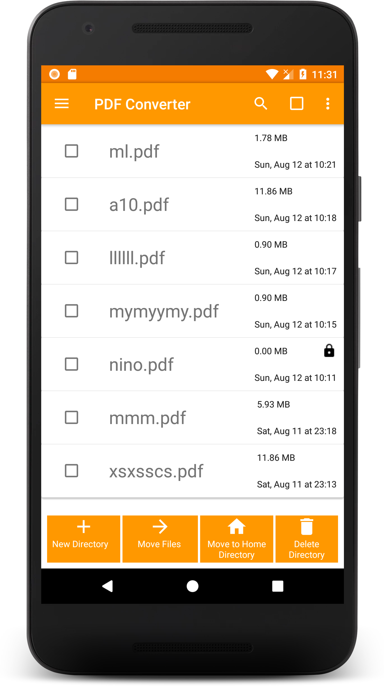 

### Different themes
Go to Settings, and you can have three type of themes : Black, Dark, White

Black | Dark | White |
--- | --- | --- |
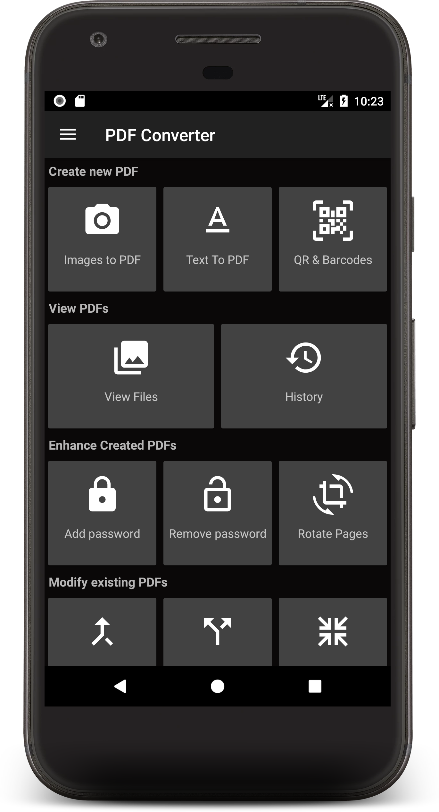 |  |  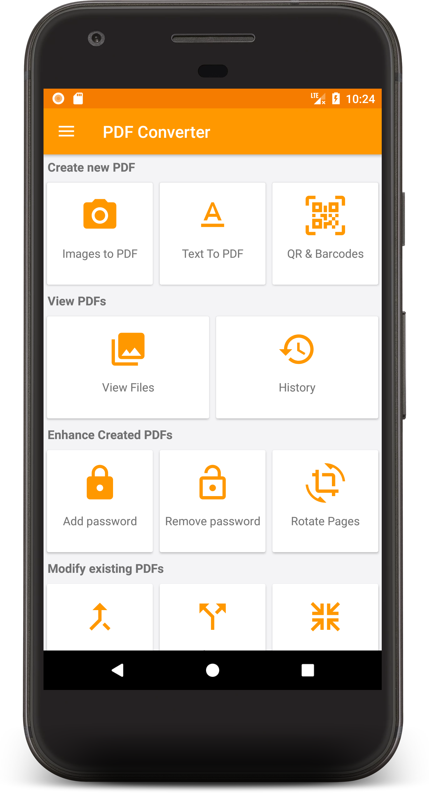 |

### Merge PDF
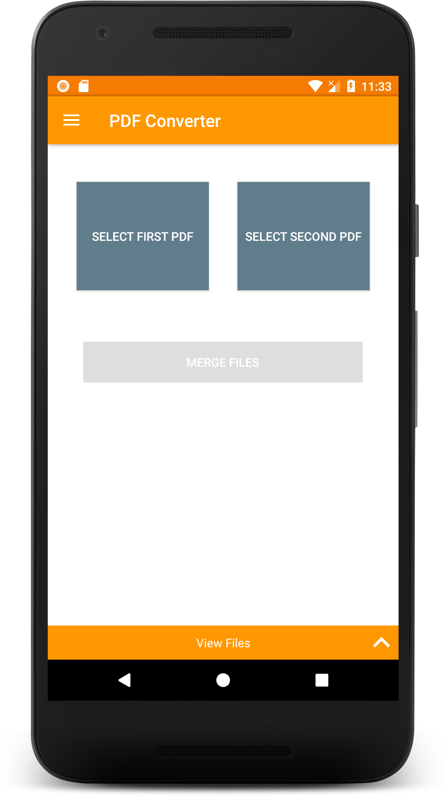

### Text to PDF
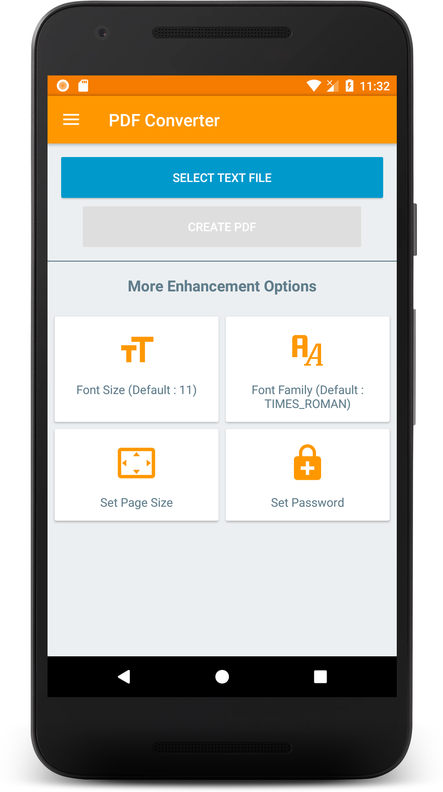

### History
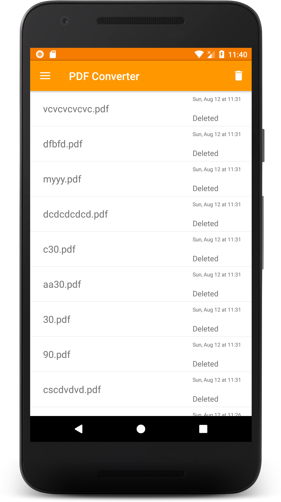

### Contributing

#### Dependencies
+ [Butterknife](https://jakewharton.github.io/butterknife/)
+ [Folderpicker](https://github.com/kashifo/android-folder-picker-library)
+ [Image-cropper](https://github.com/ArthurHub/Android-Image-Cropper)
+ [iTextG](http://developers.itextpdf.com/itextg-android)
+ [Lottie](https://github.com/airbnb/lottie-android)
+ [Matisse](https://github.com/zhihu/Matisse)
+ [Material Dialogs](https://github.com/afollestad/material-dialogs)
+ [Material Ripple](https://github.com/balysv/material-ripple)
+ [Morphing Button](https://github.com/dmytrodanylyk/android-morphing-button)
+ [Picasso](http://square.github.io/picasso/)
+ [Picasso-transformations](https://github.com/wasabeef/picasso-transformations)
+ [PhotoEditor](https://github.com/burhanrashid52/PhotoEditor)
+ [viewpager-transformers](https://github.com/geftimov/android-viewpager-transformers)
+ [What's new](https://github.com/TonnyL/WhatsNew)
+ [zxing](https://github.com/zxing/zxing)

#### Code & Issues
If you are a developer and you wish to contribute to the app please fork the project
and submit a pull request.
If you have any questions, feel free to ask [me](mailto:swati4star@gmail.com) about whatever you want.
[Here](https://github.com/Swati4star/Images-to-PDF/issues) is the list of known issues.

### Project Maintainers
This project is founded and actively maintained by [Swati Garg](https://github.com/Swati4star/). For any sort of queries feel free to mail at swati4star@gmail.com.

<a href="https://www.buymeacoffee.com/qITGMWB" target="_blank">
