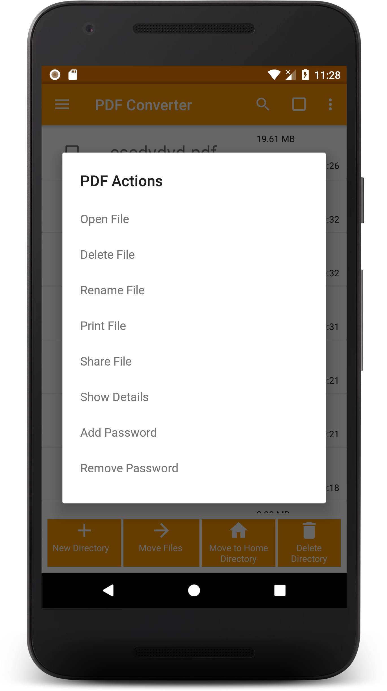

# Images To PDF

### Badges

 

Have JPG when you need a PDF? Convert JPG to PDF in a few seconds! :smiley:  
Here is an easy to use Android app to convert images to PDF file!

### Support Us

### Features 
- Create PDF from multiple images from camera or gallery
- View your converted PDFs
  - Open, Rename, Delete, print, share files
  - Sort the files order based on a number of options
  - View File details
  - Encrypt PDF
  - Decrypt PDF
  - Rotate Pages
- Different themes
- Merge existing PDFs
- Split existing PDFs
- Convert text file to PDFs
- Compress existing PDF
- Remove pages from a PDF
- Rearrange pages of a PDF
- Extract images from PDF
- History : View all the PDF related conversions

Here is a home page to get quick access to all the features "PDF Converter" provides:

 

### Creating a PDF file

##### Step 1 : User can view the PDF files previously created or create a new one! 

##### Step 2 : Select the images
 

##### Step 3 : Name the PDF file

##### Step 4 : Creating PDF

Hurray! PDF files of selected images are created.

### Viewing the PDF files

 

### Different themes
Go to Settings, and you can have three type of themes : Black, Dark and White

Black | Dark | White |
--- | --- | --- |
 |  |   |

### Merge PDF

### Text to PDF

### History

### Contributing

#### App Architecture

All folders relevant to app architecture are located in:
Images-to-PDF/app/src/main/java/swati4star/createpdf

The Images to PDF app is based off of the MVP (Model View Presenter) architecture pattern. 

Model: Responsible for keeping track of persistent data, and constains code designated for maintaining the backend (network and database layer).
> Folders:
  ./model 
  ./database

View: Frontend layer, provides UI that is fit for the data the user requests and the presenter provides. Also notifies the Presenter about user interaction with the app.
> Folders:
  ./interfaces
  ./activity
  ./fragment

Presenter: Obtains data from the backend layer when view layer changes based on user activity; middleman between model and view.
> Folders:
  ./adapter

Folder descriptions:

activity
This folder holds all of the activities of the app. Programs that most software developers are familiar with contain the main() entry point; this is where the program begins its lifecycle every time it is launched. However, within Android apps, the interaction of the user and the app doesn't always start the same way. For this reason, apps contain what are known as activities. Each activity hosts a window, a sreen to write UI in. This window is like a platform that the developer can stack modular code on top of, also known as fragments. WelcomeActivity is an activity that hosts fragments which allow the user to choose how they want to proceed with using the app.

fragments
Fragments are modular pieces of code whose lifecycle isn't dependant on the activity which hosts it. However, each each fragment requires a host activity. What this means is that the screen, or window hosting the fragments, can stay the same, and some fragments can be added or removed, enter or exit the screen as their lifecycle begins and ends, all while the host activity remains live. WelcomeActivity hosts fragments such as the AddTextFragment, which appear as clickable icons on the main window. 

adapter
If two classes need to work together, but they extend interfaces that cannot directly work in unison, then we are postentially in need of an adapter depending on the design structure of a given project. In app design as a whole and in this project, the adapter pattern converts the interface a class extends so that it can be compatible with the interface that is expected.

database
This folder contains code that is responsible for generating history of the user's interation with the app. Each user action is committed to a record with the file path, the date, and the operation type. The operation type varies based off of the service that the user chooses (create pdf from images, split existing pdfs, compress existing pdfs, etc.)

#### Dependencies
+ [Butterknife](https://jakewharton.github.io/butterknife/)
+ [Folderpicker](https://github.com/kashifo/android-folder-picker-library)
+ [Image-cropper](https://github.com/ArthurHub/Android-Image-Cropper)
+ [iTextG](http://developers.itextpdf.com/itextg-android)
+ [Lottie](https://github.com/airbnb/lottie-android)
+ [Matisse](https://github.com/zhihu/Matisse)
+ [Material Dialogs](https://github.com/afollestad/material-dialogs)
+ [Material Ripple](https://github.com/balysv/material-ripple)
+ [Morphing Button](https://github.com/dmytrodanylyk/android-morphing-button)
+ [Picasso](http://square.github.io/picasso/)
+ [Picasso-transformations](https://github.com/wasabeef/picasso-transformations)
+ [PhotoEditor](https://github.com/burhanrashid52/PhotoEditor)
+ [viewpager-transformers](https://github.com/geftimov/android-viewpager-transformers)
+ [zxing](https://github.com/zxing/zxing)

#### Code & Issues
If you are a developer and you wish to contribute to the app please fork the project
and submit a pull request.
Follow [Github Flow](https://help.github.com/articles/github-flow/) for collaboration!
If you have any questions, feel free to ask [me](mailto:swati4star@gmail.com) about whatever you want.
[Here](https://github.com/Swati4star/Images-to-PDF/issues) is the list of known issues.

### Project Maintainers
This project is founded and actively maintained by [Swati Garg](https://github.com/Swati4star/). For any sort of queries feel free to mail at swati4star@gmail.com.

