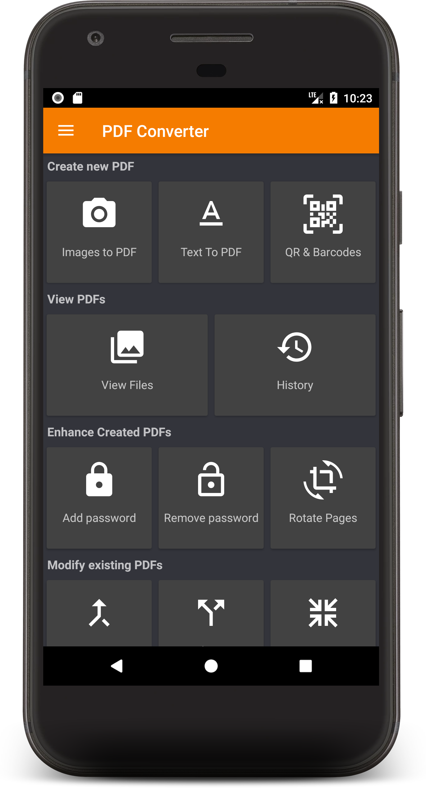

# Images To PDF

### Badges!

 

### Introduction
  This page describes converting images to pdf using the pdf converter app. This document does not include information about the installation of the [pdf converter app](https://play.google.com/store/apps/details?id=swati4star.createpdf&hl=en&gl=US&pli=1)

### Features 
- Create PDF from multiple images from camera or gallery
- View your converted PDFs
  - Open, Rename, Delete, print, share files
  - Sort the files order based on a number of options
  - View File details
  - Encrypt PDF
  - Decrypt PDF
  - Rotate Pages
- Different themes
- Merge existing PDFs
- Split existing PDFs
- Convert text file to PDFs
- Compress existing PDF
- Remove pages from a PDF
- Rearrange pages of a PDF
- Extract images from PDF
- History : View all the PDF related conversions

Here is a home page to get quick access to all the features "PDF Converter" provides:

 

### Creating a PDF file

###   

Allow pdf converter to access photos, media, and files on your device
Click on the image to pdf icon 
Click on select images
Select the image(s) to be converted 
Click Apply
Click create pdf
Enter file name 
Click ok

<!-- these are the folllowing steps  -->

##### Step 1 : Allow pdf converter to access photos, media, and files on your device
<!--  -->

##### Step 2 : Click on the image to pdf icon 
<!--   -->

##### Step 3 :Click on select images icon
<!--  -->

##### Step 4 : Select the image(s) to be converted 
<!--  -->

##### Step 5 : Click Apply 
<!--  -->

##### Step 6 : Click create pdf
<!--  -->

##### Step 7 : Enter file name 
<!--  -->

##### Step 8 :Click ok
<!--  -->

Hurray! PDF files of selected images are created.

### Viewing the PDF files
These are the steps to achieve this:
##### step 1 : Click on view file icon
##### step 2 : Select the file to be viewed 
##### step 3 : Click on the open file

 

### Different themes
Go to Settings, and you can have three type of themes : Black, Dark and White

Black | Dark | White |
--- | --- | --- |
 |  |   |

### Merge PDF

### Text to PDF

### History

### Contributing

#### Dependencies
+ [Butterknife](https://jakewharton.github.io/butterknife/)
+ [Folderpicker](https://github.com/kashifo/android-folder-picker-library)
+ [Image-cropper](https://github.com/ArthurHub/Android-Image-Cropper)
+ [iTextG](http://developers.itextpdf.com/itextg-android)
+ [Lottie](https://github.com/airbnb/lottie-android)
+ [Matisse](https://github.com/zhihu/Matisse)
+ [Material Dialogs](https://github.com/afollestad/material-dialogs)
+ [Material Ripple](https://github.com/balysv/material-ripple)
+ [Morphing Button](https://github.com/dmytrodanylyk/android-morphing-button)
+ [Picasso](http://square.github.io/picasso/)
+ [Picasso-transformations](https://github.com/wasabeef/picasso-transformations)
+ [PhotoEditor](https://github.com/burhanrashid52/PhotoEditor)
+ [viewpager-transformers](https://github.com/geftimov/android-viewpager-transformers)
+ [zxing](https://github.com/zxing/zxing)

#### Code & Issues
If you are a developer and you wish to contribute to the app please fork the project
and submit a pull request.
Follow [Github Flow](https://help.github.com/articles/github-flow/) for collaboration!
If you have any questions, feel free to ask [me](mailto:swati4star@gmail.com) about whatever you want.
[Here](https://github.com/Swati4star/Images-to-PDF/issues) is the list of known issues.

### Project Maintainers
This project is founded and actively maintained by [Swati Garg](https://github.com/Swati4star/). For any sort of queries feel free to mail at swati4star@gmail.com.

### Support Us

