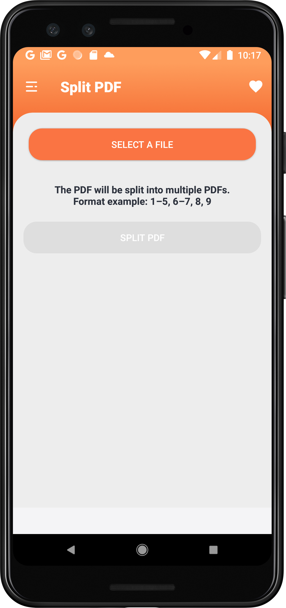
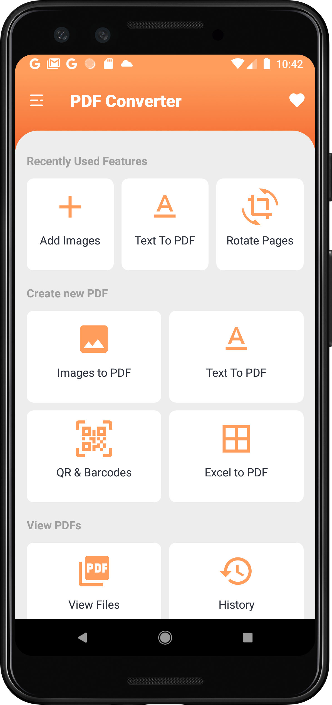

# Images To PDF

### Badges

Have JPG when you need a PDF? Convert JPG to PDF in a few seconds! :smiley:  
Here is an easy to use Android app to convert images to PDF file!

### Support Us

### Features

- [Create PDF from multiple images from camera or gallery](#creating-a-PDF-file)
	- [Convert text file to PDFs](#Text-to-PDF)
- [View your PDFs](#viewing-the-pdf-files)
    - Open, Rename, Delete, print, share files
    - Sort the files order based on a number of options
    - View File details
- [Enhance your PDFs](#enhance-your-pdfs)
    - [Encrypt PDF](#add-password)
    - [Decrypt PDF](#remove-password)
    - [Add Text](#add-text)
    - [Rotate Pages](#rotate-pages)
    - [Add Watermark](#add-watermark)
    - Add Image
- [Modify Existing PDFs](#modify-existing-pdfs)
	- [Merge existing PDFs](#merge-pdf)
	- Split existing PDFs
	- Invert PDF
	- Compress existing PDF
	- Remove pages from a PDF
- [Additional Features](#additional-features)
	- Remove Pages from a PDF
	- Rearrange pages of a PDF
	- Extract images from PDF
	- Convert a PDF to images
	- Extract Text From a PDF
	- Extract a Zip File to PDF
- [History : View all the PDF related conversions](#history)
- [Different themes](#different-themes)

Here is a home page to get quick access to all the features "PDF Converter" provides:

 

### Creating a PDF file

##### Step 1 : User can view the PDF files previously created or create a new one!

##### Step 2 : Select the images

 

##### Step 3 : Name the PDF file

##### Step 4 : Creating PDF

#### Text to PDF

Hurray! PDF files of selected images are created.

### Viewing the PDF files

 

### Enhance your PDFs

You can easily add protection, text, copy right, and images to your PDF file by using some of the enhancing features of the app.
To use any of these features, you will start by simply selecting the PDF file you want to modify. And then you can follow the prompt to edit your selected file correspondingly.

 

### Modify Existing PDFs

#### Merge PDF

### Additional Feature

Similar to enhancing your PDFs, this app also provide you the additional options to remove pages and reorder pages in your PDF, extract images and text from your PDF, cover your PDF to images, and extract PDF from a ZIP file.
To use any of these features, you will also start by simply selecting the PDF file you want to modify and follow the prompt to edit your selected file correspondingly.

 

### History

### Different themes

Go to Settings, and you can have three type of themes : Black, Dark and White

Black | Dark | White |
--- | --- | --- |
 |  |   |

### Favourite

You can add features to your "favourite" for easy access.

##### Step 1 : Click the heart icon on the upper right corner of your screen.

##### Step 2 : Click the + icon on the bottom right corner of your screen.

##### Step 3 : Select the features you want to add, then click the check mark on the upper right corner of your screen.

##### Step 4 : Now you have easy access to these features you just added!

### Contributing

#### Dependencies

+ [Butterknife](https://jakewharton.github.io/butterknife/)
+ [Folderpicker](https://github.com/kashifo/android-folder-picker-library)
+ [Image-cropper](https://github.com/ArthurHub/Android-Image-Cropper)
+ [iTextG](http://developers.itextpdf.com/itextg-android)
+ [Lottie](https://github.com/airbnb/lottie-android)
+ [Matisse](https://github.com/zhihu/Matisse)
+ [Material Dialogs](https://github.com/afollestad/material-dialogs)
+ [Material Ripple](https://github.com/balysv/material-ripple)
+ [Morphing Button](https://github.com/dmytrodanylyk/android-morphing-button)
+ [Picasso](http://square.github.io/picasso/)
+ [Picasso-transformations](https://github.com/wasabeef/picasso-transformations)
+ [PhotoEditor](https://github.com/burhanrashid52/PhotoEditor)
+ [viewpager-transformers](https://github.com/geftimov/android-viewpager-transformers)
+ [zxing](https://github.com/zxing/zxing)

#### Code & Issues

If you are a developer and wish to contribute to the app please fork the project and submit a pull request using the [pull request template](.github/pull_request_template.md).
Follow [Github Flow](https://help.github.com/articles/github-flow/) for collaboration!
If you have any questions, feel free to ask [me](mailto:swati4star@gmail.com) about whatever you
want.
[Here](https://github.com/Swati4star/Images-to-PDF/issues) is the list of known issues.

### Project Maintainers

This project is founded and actively maintained by [Swati Garg](https://github.com/Swati4star/). For
any sort of queries feel free to mail at swati4star@gmail.com.

