### Creating a PDF file

##### Step 1 : User can view the PDF files previously created or create a new one! 
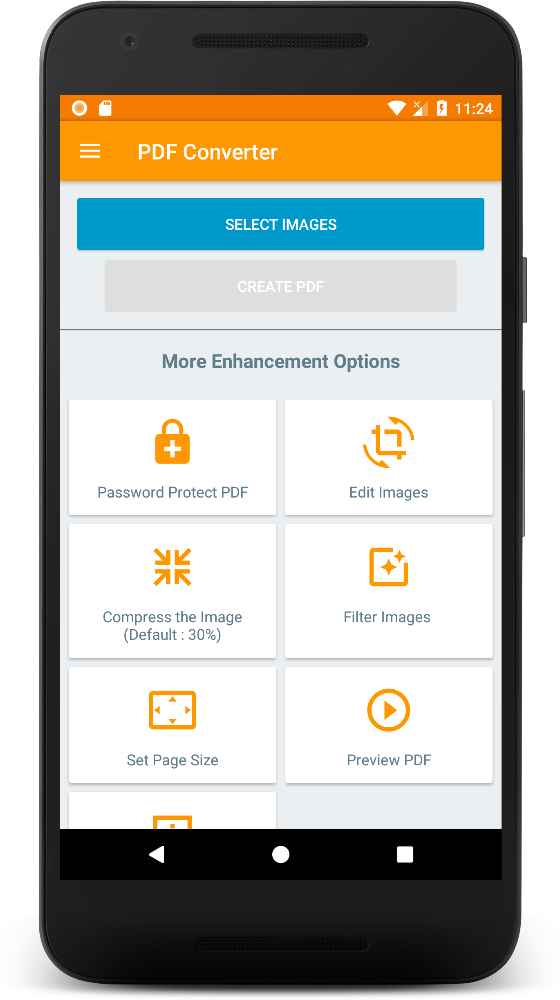

##### Step 2 : Select the images
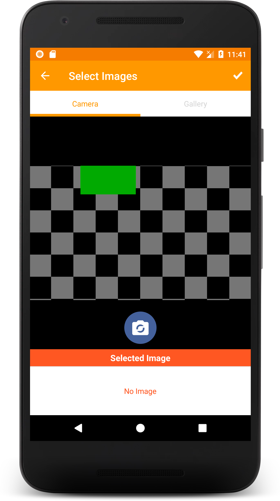 

##### Step 3 : Name the PDF file
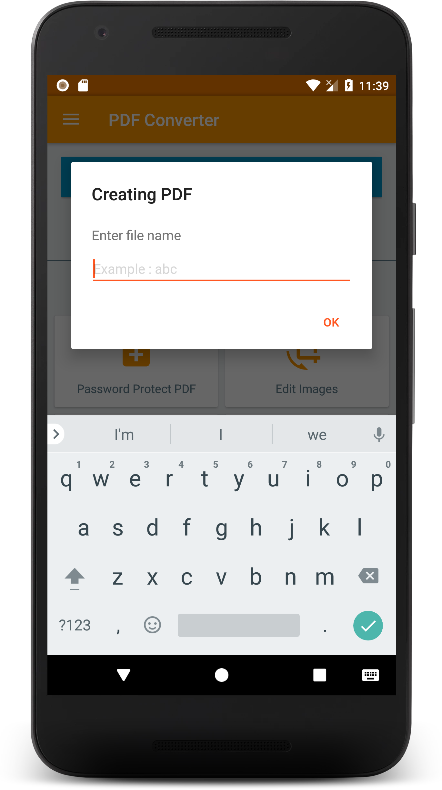

##### Step 4 : Creating PDF
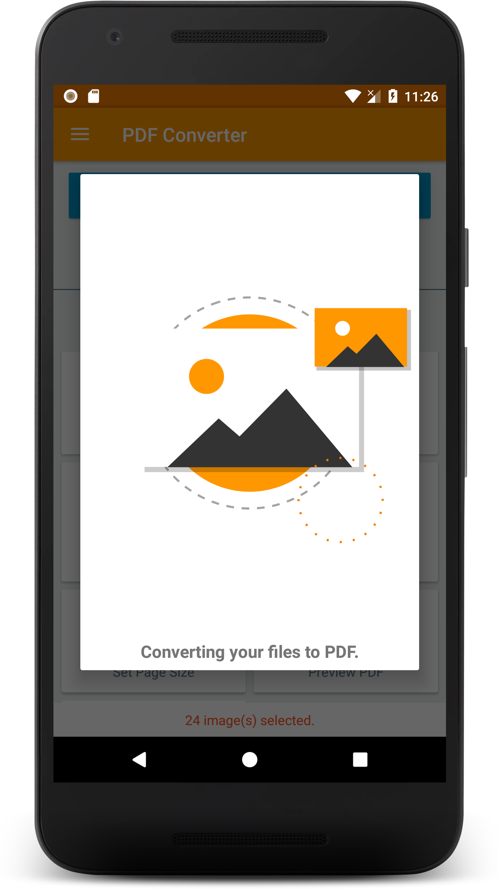

Hurray! PDF files of selected images are created.

### Viewing the PDF files

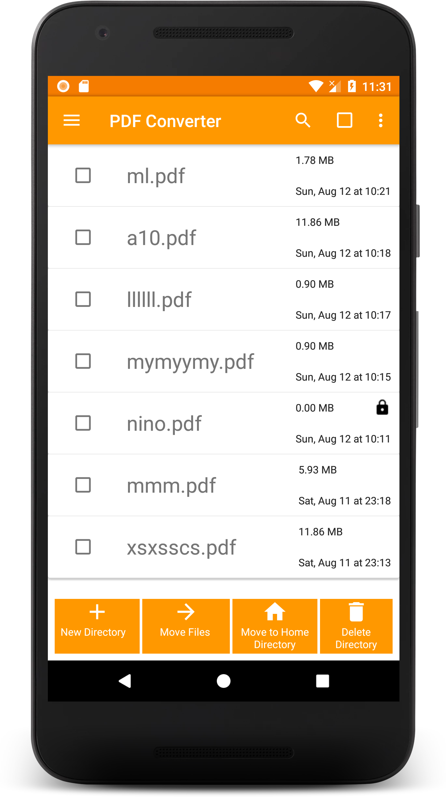 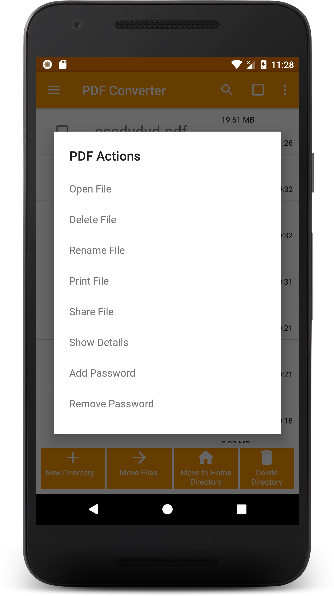

### Different themes
Go to Settings, and you can have three type of themes : Black, Dark and White

Black | Dark | White |
--- | --- | --- |
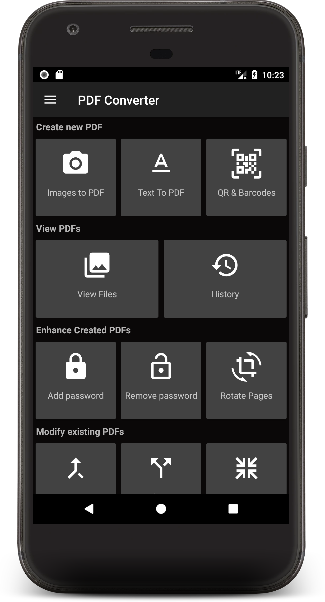 | 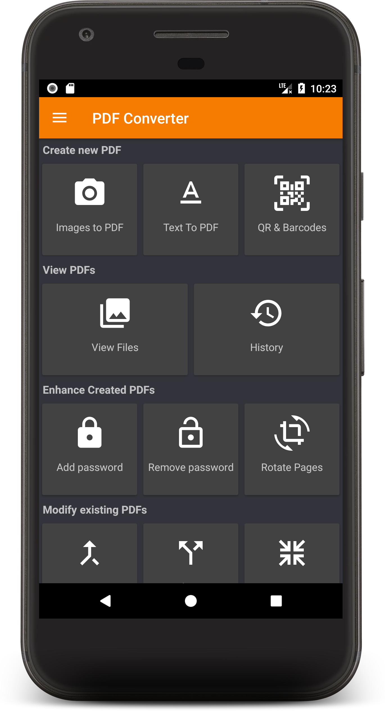 |   |

### Merge PDF
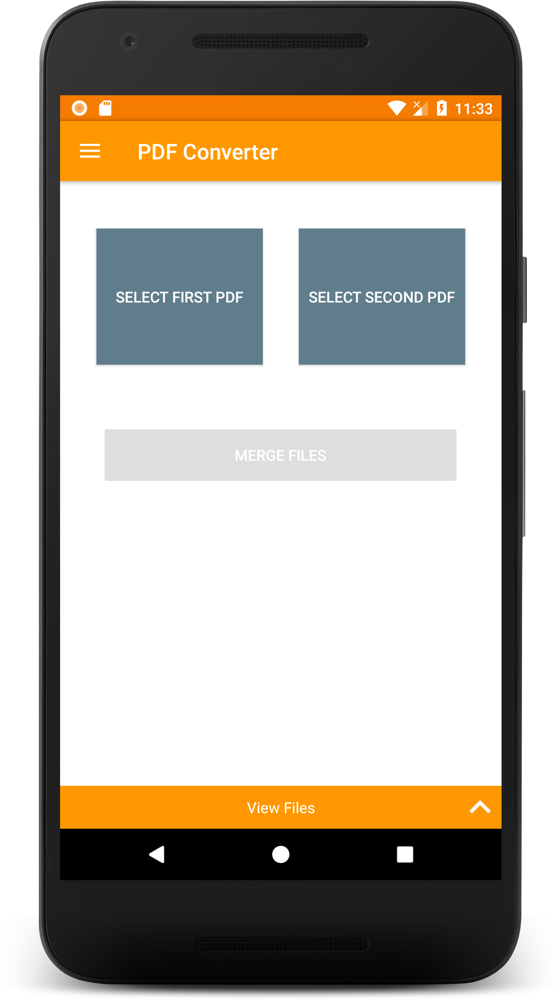

### Text to PDF
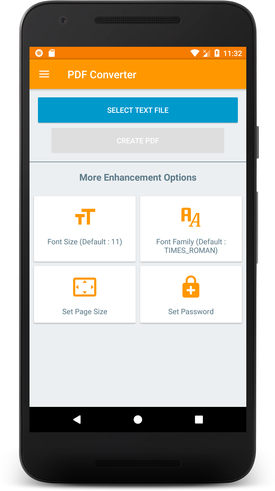

### History
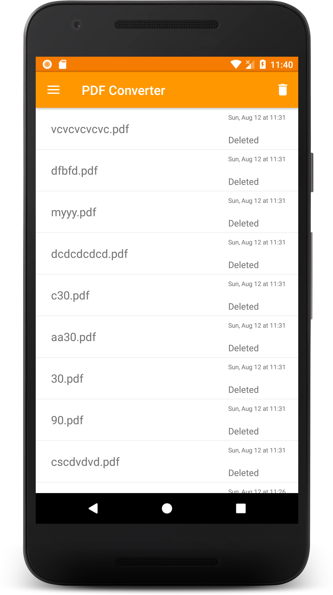